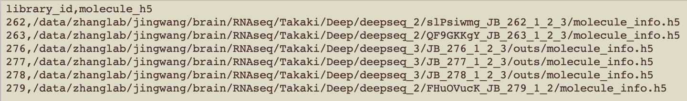

This file details all steps of the analysis.

# Package versions used in this analysis


# Set-up
## Set up working directory structure
```{r} 
cd ~/Downloads
mkdir RNAseq
  # this will be the project directory
cd RNAseq
mkdir data
cd data
mkdir memonet_data AIBS_data
```

## Clone repo
```{r} 
cd ~/Downloads/RNAseq
mkdir memonet_github_repo
cd memonet_github_repo
git clone git@github.com:zhanglab/memonet.git
```

You can find scripts here: ~/Downloads/RNAseq/memonet_github_repo/memonet/scripts


## Download Packages 
For the full list for all dependencies by script, see memonet/scripts/README

Cell Ranger v4.0.0: https://support.10xgenomics.com/single-cell-gene-expression/software/pipelines/latest/installation
- make note of download location 

Seurat v4: https://satijalab.org/seurat/articles/install.html

DESC v2.1.1: https://eleozzr.github.io/desc/installation.html 

DESeq2 v1.36.0: https://bioconductor.org/packages/release/bioc/html/DESeq2.html

clusterProfiler v4.2.2: https://bioconductor.org/packages/release/bioc/html/clusterProfiler.html


## Download datasets
```{r} 
cd ~/Downloads/RNAseq/data/memonet_data
mkdir data_download
```

MEMONET dataset:
- Location of data: https://docs.google.com/spreadsheets/d/1mU7l8Oj-Fr4FYE6IlmTcX_s2YdCtZXx0GgJI3jBE3J4/edit#gid=0 (* will need to change this to the ncbi repository number once we upload data there)
- Script for downloading: download.sh
- Download to: ~/Downloads/RNAseq/data/memonet_data/data_download

AIBS dataset:
- Location of data: *
- Download to: ~/Downloads/RNAseq/data/AIBS_data
- Rename the files to: aibs_barcodes.tsv, aibs_genes.tsv, aibs_matrix.mtx


# Pre-processing of memonet data
## Aggregate the data of all mice using Cell Ranger commands
Use Cell Ranger's aggr command to combine the data of all mice:
- Wd: ~/Downloads/RNAseq/data/memonet_data
- Generate a libraries.csv file with the locations of each mouse's data, in the following format: 

  - the order of rows determines the suffix attached to the barcodes of each mouse (in order to differentiate which mouse is which in the combined file), ie mouse 262 will have -1, 263 -2, etc
  - trained mice: 263,277,279 ie -2,-4,-6
  - control mice: 262,276,278 ie -1,-3,-5
- Run aggr command:
  - First run this line on the terminal so that Cell Ranger package can be found, replacing the path with the location of your Cell Ranger download location: 
  ```{r} 
  export PATH=<path to cellranger download>/cellranger-4.0.0:$PATH
  ```
  - Then run aggr. --none turns off depth normalization, due to the requirement of the DESC clustering package needing unnormalized counts as input. --id is the name of the output file
  ```{r}
  nohup srun -o jobs%j.out -c 20 \cellranger aggr --csv=/data/memonet_data/libraries.csv --none --id=combined_cellranger_no-normalization &
  ```
   - The output directory will be found here: ~/Downloads/RNAseq/data/memonet_data/combined_cellranger_no-normalization/outs/filtered_feature_bc_matrix
 
## Determine QC thresholds
```{r}
cd ~/Downloads/RNAseq
mkdir QC
```

Script: QCthresholds.r 
- Thresholds were chosen based on violin plots of the data before QC

Wd: ~/Downloads/RNAseq/QC

Input: 
- Data directory for each mouse, ie ~/Downloads/RNAseq/data/memonet_data/data_download/slPsiwmg_JB_262_1_2_3/filtered_feature_bc_matrix/

Output:
- ctrl_without_cutoff.png: violin plots of the 3 control mice before QC
- QC_ctrl.png: violin plots of the 3 control mice after QC
- train_without_cutoff.png
- QC_train.png


# Map MEMONET data onto AIBS dataset ("OA mapping")
```{r}
cd ~/Downloads/RNAseq
mkdir AIBSmapping
cd AIBSmapping
mkdir OA test
  # 'OA' refers to Our (MEMONET) data mapped to AIBS data
cd OA
mkdir barcode_files count_matrices 
```

Script: mapping_OA.r

Wd: ~/Downloads/RNAseq/AIBSmapping/OA

Query: MEMONET data

Reference: AIBS data

Input: 
- 10X directory of all mice combined: ~/Downloads/RNAseq/data/memonet_data/combined_cellranger_no-normalization/outs/filtered_feature_bc_matrix/
- AIBS dataset. The three files here: ~/Downloads/RNAseq/data/AIBS_data

Output: 
- prediction_scores.csv: lists each cell, the predicted cell type label, and prediction scores for each cell type
- umap_AIBS_subclassLabelLegend.png: umap of the reference (AIBS data) with cell type subclass labels
- umap_MEMONET_subclassLabelLegend.png: umap of the query (MEMONET data) projected onto AIBS space, labeled with the predicted labels


## Test the accuracy of mapping on AIBS data
### 1. Generate a test dataset (downsample to 25% of each cell type; remove sample cells from rest of reference) and perform label transfer from the remaining 75% of data. Do this 100 times.

Query: 25% of AIBS data

Reference: remaining 75% of AIBS data

Script: mapping_test1.r

Wd: ~/Downloads/RNAseq/AIBSmapping/test

Input: 
- AIBS dataset. The three files here: RNAseq/data/AIBS_data
 
Output:
- 100 prediction_scores_*.csv files

### 2. Combine the 100 prediction score files into one file
Script: mapping_test2.r 

Wd: ~/Downloads/RNAseq/AIBSmapping/test

Input: 
- 100 prediction_scores_*.csv files
 
Output:
- prediction_cutoff.csv

### 3. Summarize results: calculate false classification percentage, generate confusion matrix, compare mean and median scores of the test and OA mapping
Script: mapping_test3.r

Wd: ~/Downloads/RNAseq/AIBSmapping/test

Input: 
- ~/Downloads/RNAseq/AIBSmapping/test/prediction_cutoff.csv
- ~/Downloads/RNAseq/AIBSmapping/OA/prediction_scores.csv

Output:
- AIBStest_confusionMtx.png: heatmap of original cell type labels vs predicted labels for AIBS testing
- maxPredictionScores-AIBStest_and_OA.csv: table of mean and median prediction.score.max for AIBS testing and OA mapping; shows calculation for all celltypes and subset for L2/3 cells


# Determine a L2/3 mapping reliability cutoff
Each MEMONET cell gets a prediction score for each cell type in the AIBS dataset; all scores add up to 1. The cell type with the largest score becomes that cell's predicted cell type. To ensure we analyze only L2/3 neurons, we want to remove cells with low reliability for being labeled as L2/3. Reliability is calculated as the sum of prediction scores for L2/3 IT_1, L2/3 IT_2, and L2/3 IT_3.

## Generate lists of barcodes remaining at each cutoff value
Script: prediction_score_cutoff_barcodes.r
- This script generates barcode lists for various prediction score cutoff values (0 to 0.5). 
Wd: ~/Downloads/RNAseq/AIBSmapping/OA/barcode_files/

Input: 
- ~/Downloads/RNAseq/AIBSmapping/OA/prediction_scores.csv

Output: 
- One file for each cutoff, listing the cell barcodes remaining: L23barcodes-fromAIBS_*.csv

## Calculate normalized counts for the L2/3 cells
Script: DESCnormalization.r

Wd: ~/Downloads/RNAseq/AIBSmapping/OA/count_matrices

Set the 'cutoff' variable to '0' so that all cells predicted to be L2/3 are kept for normalization.

Input:
- Barcode file for all predicted L2/3 cells: ~/Downloads/memonet/prediction_score_cutoff_barcodes/L23barcodes-fromAIBS_0.csv

Output:
- DESCnormalized_counts_L23_0.csv

## Determine proper cutoff based on marker gene expression
Script: celltype_contaminants.r
- This script calculates the mean expression of L2/3 marker genes (Cux2, Otof, Rtn4rl1, Slc30a3, Cacna2d3) and glial marker (Mertk) for the cells that are removed at each cutoff. We want to choose a cutoff that removes cells with low values of L2/3 markers but high values of Mertk, to ensure that mostly glial cells are removed.

Wd: ~/Downloads/RNAseq/AIBSmapping/OA/barcode_files/

Input:
- Barcode files for each cutoff: ~/Downloads/RNAseq/AIBSmapping/OA/barcode_files/L23barcodes-fromAIBS_*.csv
- Normalized expression: ~/Downloads/RNAseq/AIBSmapping/OA/count_matrices/DESCnormalized_counts_L23_0.csv

Output:
- markerGeneExp_predictionCutoffs.csv: table listing the average expression of each marker gene for each cutoff.

We chose a cutoff value of 0.3, as it has the highest mean expression of Mertk while having low expression of L2/3 markers. Any cell that was predicted to be L2/3 and has a sum of prediction scores for L2/3 IT_1, L2/3 IT_2, L2/3 IT_3 <= 0.3 will not be included in downstream analysis.


# Investigate cell type proportions
Script: dataset_descriptions.r, Part A

Functions:
- calculate cell subclass proportion (neurons and glia)
- calculate inhibitory neuron percentage
- calculate neuron subclass proportion (neurons only)
- plot neuron subclass proportion, comparing MEMONET dataset and AIBS

Input:
- AIBS metadata: ~/Downloads/RNAseq/data/AIBS_data/aibs_barcodes.tsv
- cell type predictions for MEMONET data: ~/Downloads/RNAseq/AIBSmapping/OA/prediction_scores.csv

Output:
- plot of neuronal subclass proportions: ~/Downloads/RNAseq/AIBSmapping/OA/CelltypePropPerDataset.png


## L2/3 subtypes: Is there train/control enrichment?
Script: statistics.r

Wd: ~/Downloads/RNAseq/AIBSmapping/OA/

Input: 
- Choose an input file at the beginning of script. For this part calculating L2/3 proportions, use ~/Downloads/RNAseq/AIBSmapping/OA/prediction_scores.csv
- L2/3 barcode list: ~/Downloads/RNAseq/AIBSmapping/OA/barcode_files/L23barcodes-fromAIBS_0.3.csv

Output:
- L23subclass_tr_ctrl_prop_hist.png
- 'summary' variable lists p-values


# Cluster L2/3 neurons 
## 1. Normalize counts
Script: DESCnormalization.r

Set 'cutoff' variable to '0.3'

Input:
- MEMONET data: ~/Downloads/RNAseq/data/memonet_data/combined_cellranger_no-normalization/outs/filtered_feature_bc_matrix

Output:
- ~/Downloads/RNAseq/QC/cells_after_QC.csv: list of cells remaining after QC steps on whole dataset. Needed for DE analysis of clusters
- ~/Downloads/RNAseq/QC/genes_after_QC.csv: list of genes remaining after QC steps. Needed for the background gene list for GO analyses
- ~/Downloads/RNAseq/AIBSmapping/OA/count_matrices/unnormalized_counts_L23_0.3.csv: unnormalized counts of L2/3 cells, 0.3 cutoff
- ~/Downloads/RNAseq/AIBSmapping/OA/count_matrices/DESCnormalized_counts_L23_0.3.csv: normalized counts of L2/3 cells, 0.3 cutoff. This will be used as input for classifier training
- ~/Downloads/RNAseq/AIBSmapping/OA/count_matrices/sampleIDs_0.3.csv: list of cells and mouse ID, for reference during classifier training
- ~/Downloads/RNAseq/AIBSmapping/OA/count_matrices/sampleIDs_0.3_transpose.csv: same as above but the transposed version

## 2. Subset to EDGs 
```{r}
cd ~/Downloads/RNAseq/
mkdir cluster_by_genes
cd cluster_by_genes
mkdir 0.3cutoff
```

### First, download the EDG list
Location on github: memonet/downloads/PredictionGenesDescending0.3.csv
- This file contains all genes in the dataset, ranked by their weight in the linear classifier. We will subset to the top 3000 as the EDGs

Download to: ~/Downloads/RNAseq/cluster_by_genes/0.3cutoff

### Then, subset the normalized counts to the EDGs
Script: DESC_inputFormat.r

Wd: ~/Downloads/RNAseq/cluster_by_genes/0.3cutoff

Input:
- Ranked gene list: ~/Downloads/RNAseq/cluster_by_genes/0.3cutoff/PredictionGenesDescending0.3.csv
- L2/3 normalized counts: ~/Downloads/RNAseq/AIBSmapping/OA/count_matrices/DESCnormalized_counts_L23_0.3.csv

Output: ~/Downloads/RNAseq/cluster_by_genes/0.3cutoff/L23_0.3_EDGmtx.csv


## 3. Determine parameter settings for running DESC
We varied the n_neighbors (n) and louvain_resolution (L) parameters and calculated silhouette scores of the resulting clusters in order to find the best parameters for clustering our data.

### Cluster with various parameter settings and calculate silhouette scores
```{r}
cd ~/Downloads/RNAseq/cluster_by_genes/
mkdir DESC_parameter_test
```

Script: DESC_EDGclustering_loop.py
- This script loops through various parameter combinations

Wd: ~/Downloads/RNAseq/cluster_by_genes/DESC_parameter_test/

Input:
- Normalized L2/3 counts: ~/Downloads/RNAseq/cluster_by_genes/0.3cutoff/L23_0.3_EDGmtx.csv

Output: n represents the value set for n_neighbors; L represents the value set for louvain_resolution
- cluster_n*.L*.csv
- umap_n*.L*.csv
- sil_scores_n*.L*.csv

### Summarize the silhouette scores of each run
Calculate average silhouette score for each clustering result, and visualize scores with respect to the n and L parameters.

Wd: ~/Downloads/RNAseq/cluster_by_genes/DESC_parameter_test/

Script: DESCparameterSummary.r

Input:
- Silhouette scores for each run: ~/Downloads/RNAseq/cluster_by_genes/DESC_parameter_test/sil_scores_n*.L*.csv

Output:
- parameter_silhouette_score_avgs.csv: summary of the silhouette score and number of clusters produced with each parameter setting combination
- heatmap_silScore.png: a heatmap showing the average silhouette score at each combination of n and L parameters

Most scores are very good. A score of -1 indicates wrong clustering, +1 indicates correct clustering, and 0 indicates overlapping clusters.

### Run a smoothing algorithm to find the peak
Script: sil_score_smooth.py
- Dr. EunJung Hwang wrote this script

Wd: ~/Downloads/RNAseq/cluster_by_genes/DESC_parameter_test/

Input: 
- Silhouette score summary: ~/Downloads/RNAseq/cluster_by_genes/DESC_parameter_test/parameter_silhouette_score_avgs.csv

Output:
- Smooth_Silhouette.png: left plot is a heatmap of silhouette scores by n and L parameters (similar to heatmap_silScore.png); right plot is a smoothed version, with red x indicating the peak

Running a smoothing algorithm on the heatmap of silhouette scores by n and L parameters reveals n=25 and L=0.65 to be at the peak of scores.
Therefore, we chose n=25 and L=0.65.


## 4. Run DESC clustering
```{r}
cd ~/Downloads/RNAseq/cluster_by_genes/0.3cutoff
mkdir DESC
```

Script: DESC_EDGclustering.py

Wd: ~/Downloads/RNAseq/cluster_by_genes/0.3cutoff/DESC

Parameters are set to: 
- n_neighbors = n = 25
- louvain_resolution = L = 0.65

Input: 
- Normalized expression matrix, subset to EDGs: ~/Downloads/RNAseq/cluster_by_genes/0.3cutoff/L23_0.3_EDGmtx.csv

Output:
- clusters_n25.L0.65.csv: lists each cell barcode and the cluster it is assigned
- umap_n25.L0.65.csv: umap x and y coordinates; row indices correspond to the barcode order in clusters_n25.L0.65.csv
- tsne_n25.L0.65.csv: tsne x and y coordinates
- result_DESC.n25.L0.65/: directory for encoder weights and model info
- figures/
   - umap0.65desc.n25.L0.65.png: visual of cluster umap projection 


## 5. Visualize cluster train/control proportion
Script: classifier_umap_plot.r

Wd: ~/Downloads/RNAseq/cluster_by_genes/0.3cutoff/DESC/figures

Input: 
- Cluster file: ~/Downloads/RNAseq/cluster_by_genes/0.3cutoff/DESC/clusters_n25.L0.65.csv
- Umap coordinate file: ~/Downloads/RNAseq/cluster_by_genes/0.3cutoff/DESC/umap_n25.L0.65.csv

Output: classifier_umap_tr_ctrl.svg

### Is there train/control enrichment?
Script: statistics.r

Wd: ~/Downloads/RNAseq/cluster_by_genes/0.3cutoff/DESC/figures

Input:
- Choose an input file at the beginning of script. For this part calculating cluster train/control proportions, use ~/Downloads/RNAseq/cluster_by_genes/0.3cutoff/DESC/clusters_n25.L0.65.csv

Output:
- cluster_tr_ctrl_prop_hist.svg
- 'summary' variable lists p-values

### How many cells are in each cluster?
Script: dataset_descriptions.r, Part D

Wd: ~/Downloads/RNAseq/cluster_by_genes/0.3cutoff/DESC/figures

Input: 
- Clusters file: ~/Downloads/RNAseq/cluster_by_genes/0.3cutoff/DESC/clusters_n25.L0.65.csv

Output:
- cluster_percentage_tbl.csv


# GO analysis of the 3000 EDGs
What biological processes are supported by the 3000 EDGs?

```{r}
cd ~/Downloads/RNAseq/cluster_by_genes/0.3cutoff
mkdir GO
cd GO
mkdir EDG clusters
```

Script: GOvisualization.r, part A

Wd: ~/Downloads/RNAseq/cluster_by_genes/0.3cutoff/GO/EDG

Input: 
- Ranked gene list (containing the EDGs): ~/Downloads/RNAseq/cluster_by_genes/0.3cutoff/PredictionGenesDescending0.3.csv
- Background gene list: ~/Downloads/RNAseq/QC/genes_after_QC.csv. The background gene list represents all genes in the dataset.

Output: 
- EDG_GO.csv: GO results for the 3000 EDGs 
- EDG_GO.png: treeplot showing GO results for the 3000 EDGs


# DE analysis for glutamatergic, GABAergic neurons
## 1. Generate barcode files for glutamatergic and GABAergic neurons
Script: dataset_descriptions.r, Part B

Input: data_neurons variable from Part A

Output: 
- ~/Downloads/RNAseq/AIBSmapping/OA/barcode_files/AIBS-defined_glut_barcodes.csv
- ~/Downloads/RNAseq/AIBSmapping/OA/barcode_files/AIBS-defined_GABA_barcodes.csv

## 2. Run DESeq2, train vs control
```{r}
cd ~/Downloads/RNAseq/AIBSmapping/OA
mkdir DESeq2
cd DESeq2
mkdir glut_tr_vs_ctrl GABA_tr_vs_ctrl
```

Script: DESeq2_tr_vs_ctrl.r


**DE analysis of glutamatergic neurons:**

Wd: ~/Downloads/RNAseq/AIBSmapping/OA/DESeq2/glut_tr_vs_ctrl

Input: ~/Downloads/RNAseq/AIBSmapping/OA/barcode_files/AIBS-defined_glut_barcodes.csv

Output:
- unnormalized_counts_from_dds.csv: unnormalized gene expression
- normalized_sizeFactors_calculateSumFactors.csv: size factors that generate the normalized data
- normalized_counts_from_dds.csv: normalized gene expression
- train_vs_control_all_genes.csv: DESeq2 results for all genes
- train_vs_control_sig_genes.csv: DESeq2 results for significant genes (padj <0.05)


**DE analysis of GABAergic neurons:**

Wd: ~/Downloads/RNAseq/AIBSmapping/OA/DESeq2/GABA_tr_vs_ctrl

Input: ~/Downloads/RNAseq/AIBSmapping/OA/barcode_files/AIBS-defined_GABA_barcodes.csv

Output:
- unnormalized_counts_from_dds.csv: unnormalized gene expression
- normalized_sizeFactors_calculateSumFactors.csv: size factors that generate the normalized data
- normalized_counts_from_dds.csv: normalized gene expression
- train_vs_control_all_genes.csv: DESeq2 results for all genes
- train_vs_control_sig_genes.csv: DESeq2 results for significant genes (padj <0.05)


## 3. Summarize DE results: what IEGs are significant?
Script: genelist.r 

Input:
- DE results for GABAergic neurons: ~/Downloads/RNAseq/AIBSmapping/OA/DESeq2/GABA_tr_vs_ctrl/train_vs_control_sig_genes.csv
- DE results for glutamatergic neurons: ~/Downloads/RNAseq/AIBSmapping/OA/DESeq2/glut_tr_vs_ctrl/train_vs_control_sig_genes.csv

Output:
- ~/Downloads/RNAseq/AIBSmapping/OA/DESeq2/glut_tr_vs_ctrl/GABA_IEG_DEresults.csv: IEGs that are significant according to DE analysis
- ~/Downloads/RNAseq/AIBSmapping/OA/DESeq2/glut_tr_vs_ctrl/glut_IEG_DEresults.csv


# DE analysis for L2/3 neurons
```{r}
cd ~/Downloads/RNAseq/AIBSmapping/OA/DESeq2
mkdir L23_0.3_tr_vs_ctrl
```

## 1. Run DESeq2: train vs control
Script: DESeq2_tr_vs_ctrl.r

Wd: ~/Downloads/RNAseq/AIBSmapping/OA/DESeq2/L23_0.3_tr_vs_ctrl

Input: L2/3 barcode list: ~/Downloads/RNAseq/AIBSmapping/OA/barcode_files/L23barcodes-fromAIBS_0.3.csv

Output:
- unnormalized_counts_from_dds.csv: unnormalized gene expression
- normalized_sizeFactors_calculateSumFactors.csv: size factors that generate the normalized data
- normalized_counts_from_dds.csv: normalized gene expression
- train_vs_control_all_genes.csv: DESeq2 results for all genes
- train_vs_control_sig_genes.csv: DESeq2 results for significant genes (padj <0.05)


## 2. Summarize DE results: what IEGs are significant?
Script: genelist.r 

Input:
- DE results for L2/3 neurons: ~/Downloads/RNAseq/AIBSmapping/OA/DESeq2/L23_0.3_tr_vs_ctrl/train_vs_control_sig_genes.csv

Output:
- ~/Downloads/RNAseq/AIBSmapping/OA/DESeq2/L23_0.3_tr_vs_ctrl/L23_IEG_DEresults.csv: IEGs that are significant according to DE analysis


## 3. How many DEGs overlap with the 3000 experience-dependent genes (EDGs) used for clustering?
Script: dataset_descriptions.r, part C

Input:
- Ranked gene list: ~/Downloads/RNAseq/cluster_by_genes/0.3cutoff/PredictionGenesDescending0.3.csv
- L2/3 DEG list: ~/Downloads/RNAseq/AIBSmapping/OA/DESeq2/L23/all_cells_combined/train_vs_control_sig_genes.csv

Output: The length of DEGoverlap$gene will tell you how many genes are shared between the two gene sets


# DE analysis of clusters
## 1. Run DESeq2, one cluster vs the others
```{r}
cd ~/Downloads/RNAseq/cluster_by_genes/0.3cutoff/DESC
mkdir DESeq2
cd DESeq2
mkdir n25.L0.65
```

Script: DESeq2_clusterX_vs_others.r

Wd: ~/Downloads/RNAseq/cluster_by_genes/0.3cutoff/DESC/DESeq2/n25.L0.65

Input: 
- Cluster file: ~/Downloads/RNAseq/cluster_by_genes/0.3cutoff/DESC/clusters_n25.L0.65.csv
- unnormalized counts file: ~/Downloads/RNAseq/AIBSmapping/OA/count_matrices/unnormalized_counts_L23_0.3.csv

Output directory: all_cells/
- unnormalized_counts_from_dds.csv: unnormalized gene expression
- normalized_sizeFactors_calculateSumFactors.csv: size factors that generate the normalized data
- normalized_counts_from_dds.csv: normalized gene expression
- *_vs_others_all_genes.csv: DESeq2 results for all genes
- *_vs_others_sig_genes.csv: DESeq2 results for significant genes (padj <0.05)

**Combine cluster result files into one file:** 

Script: DESeq2-table.r

Wd: ~/Downloads/RNAseq/cluster_by_genes/0.3cutoff/DESC/DESeq2/n25.L0.65/all_cells

Input: files ending in *_all_genes.csv

Output: 
- DEGstats_allGenes.csv: all genes
- DEGstats_padj0.05.csv: significant genes (padj <0.05)


## 2. Summarize DE results: what IEGs are significant?
DEGvisuals.r, Part A

Wd: ~/Downloads/RNAseq/cluster_by_genes/0.3cutoff/DESC/DESeq2/n25.L0.65/all_cells/

Input:
- DE results: ~/Downloads/RNAseq/cluster_by_genes/0.3cutoff/DESC/DESeq2/n25.L0.65/all_cells/DEGstats_allGenes.csv
- DESeq2 normalized counts: ~/Downloads/RNAseq/cluster_by_genes/0.3cutoff/DESC/DESeq2/n25.L0.65/all_cells/normalized_counts_from_dds.csv
- Cluster file: ~/Downloads/RNAseq/cluster_by_genes/0.3cutoff/DESC/clusters_n25.L0.65.csv

Output:
- IEG_lineplot_zscore.png: line plot indicating the average z-scored expression value of IEGs across clusters. DE significance is indicated by open or closed dot.


# Map AIBS L2/3 cells onto MEMONET clusters and annotate by cluster 
```{r}
cd ~/Downloads/RNAseq/AIBSmapping
mkdir AO
  # 'AO' stands for AIBS onto Our (MEMONET) cells
cd AO
mkdir n25.L0.65
```

Script: mapping_AO.r

Wd: ~/Downloads/RNAseq/AIBSmapping/AO/n25.L0.65

Input:
- MEMONET data: ~/Downloads/RNAseq/data/memonet_data/combined_cellranger_no-normalization/outs/filtered_feature_bc_matrix/
- AIBS dataset. The three files here: ~/Downloads/RNAseq/data/AIBS_data
- Cluster file: ~/Downloads/RNAseq/cluster_by_genes/0.3cutoff/DESC/clusters_n25.L0.65.csv
- Umap coordinate file: ~/Downloads/RNAseq/cluster_by_genes/0.3cutoff/DESC/umap_n25.L0.65.csv

Output:
- prediction_scores.csv: prediction score for the AIBS cells onto the clusters
- Images:
  - umap_MEMONETL23.png: MEMONET cells visualized in the DESC-generated umap space 
  - umap_AIBSL23.png: AIBS cells placed in classifier space, colored by their predicted cluster

**What proportion of AIBS cells map to each cluster?**
Script: dataset_description.r, Part E

Wd: ~/Downloads/RNAseq/AIBSmapping/AO/n25.L0.65

Input: ~/Downloads/RNAseq/AIBSmapping/AO/n25.L0.65/prediction_scores.csv

Output: 
- AIBSpie.svg: pie chart of proportions 
- AIBSmap_table: summary table


# DE analysis of clusters
## 1. Run DESeq2, one cluster vs baseline
Script: DESeq2_clusterX_vs_clusterY.r

Wd: ~/Downloads/RNAseq/cluster_by_genes/0.3cutoff/DESC/DESeq2/n25.L0.65/

Input: 
- Cluster file: ~/Downloads/RNAseq/cluster_by_genes/0.3cutoff/DESC/clusters_n25.L0.65.csv

Set 'ref' variable to '0' to indicate cluster 0 as the baseline comparison

Output directory: x_vs_0/all_cells/
- unnormalized_counts_from_dds.csv: unnormalized gene expression
- normalized_sizeFactors_calculateSumFactors.csv: size factors that generate the normalized data
- normalized_counts_from_dds.csv: normalized gene expression
- x_vs_0_all_genes.csv: DESeq2 results for all genes
- x_vs_0_sig_genes.csv: DESeq2 results for significant genes (padj <0.05)

**Combine cluster result files into one file:** 
Script: DESeq2-table.r

Wd: ~/Downloads/RNAseq/cluster_by_genes/0.3cutoff/DESC/DESeq2/n25.L0.65/x_vs_0/all_cells/

Input: files ending in *_all_genes.csv

Output: 
- DEGstats_allGenes.csv: all genes
- DEGstats_padj0.05.csv: significant genes (padj <0.05)

## 2. Summarize DE results: what IEGs are significant?
DEGvisuals.r, Part B

Wd: ~/Downloads/RNAseq/cluster_by_genes/0.3cutoff/DESC/DESeq2/n25.L0.65/x_vs_0/all_cells/

Input:
- DE results: ~/Downloads/RNAseq/cluster_by_genes/0.3cutoff/DESC/DESeq2/n25.L0.65/x_vs_0/all_cells/DEGstats_allGenes.csv
- DESeq2 normalized counts: ~/Downloads/RNAseq/cluster_by_genes/0.3cutoff/DESC/DESeq2/n25.L0.65/x_vs_0/all_cells/normalized_counts_from_dds.csv
- Cluster file: ~/Downloads/RNAseq/cluster_by_genes/0.3cutoff/DESC/clusters_n25.L0.65.csv

Output:
- IEG_lineplot_refC0.png: line plot indicating the LFC value of IEGs across clusters. DE significance is indicated by open or closed dot. LFC is a metric used by DESeq2 to assess how much a gene’s expression has changed between the two comparisons. A positive value indicates upregulation in comparison to C0 while negative indicates downregulation


# Gene Ontology analysis of clusters
Script: GOvisualization.r, Part B

Wd: ~/Downloads/RNAseq/cluster_by_genes/0.3cutoff/GO/clusters/n25.L0.65/x_vs_0

Set 'regulation' variable to 'up' in order to analyze the upregulated genes only

Input:
- Background gene list: ~/Downloads/RNAseq/QC/genes_after_QC.csv
- DE results from x vs 0 scenario: ~/Downloads/RNAseq/cluster_by_genes/0.3cutoff/DESC/DESeq2/n25.L0.65/x_vs_0/all_cells/DEGstats_padj0.05.csv

Output:
- GOresults_n25.L0.65_Bio-upregDEG.csv: csv file of results for all clusters
- * up_treeBio_n25.L0.65.png: tree plot showing the top 30 most significant GO terms; one tree plot for each cluster


## Investigate C4 contamination
C4's tree plot shows terms characterizing other cell types. Perhaps this cluster contains contaminants that were not filtered out by the L2/3 prediction cutoff threshold.

Script: celltype_contaminants.r, Part B

Wd: ~/Downloads/RNAseq/cluster_by_genes/0.3cutoff/DESC/

Input:
- Normalized counts: ~/Downloads/RNAseq/AIBSmapping/OA/count_matrices/DESCnormalized_counts_L23_0.3.csv
- Clusters: ~/Downloads/RNAseq/cluster_by_genes/0.3cutoff/DESC/clusters_n25.L0.65.csv

Output:
- L23_glial_marker_exp.csv


## Visualize select GO terms in the clusters
Script: GOvisualization.r, Part C.1

Wd: ~/Downloads/RNAseq/cluster_by_genes/0.3cutoff/GO/clusters/n25.L0.65/x_vs_0

Input:
- GO results: ~/Downloads/RNAseq/cluster_by_genes/0.3cutoff/GO/clusters/n25.L0.65/x_vs_0/GOresults_n25.L0.65_Bio-upregDEG.csv
- DESeq2-normalized counts: ~/Downloads/RNAseq/cluster_by_genes/0.3cutoff/DESC/DESeq2/n25.L0.65/all_cells/normalized_counts_from_dds.csv
- Clusters: ~/Downloads/RNAseq/cluster_by_genes/0.3cutoff/DESC/clusters_n25.L0.65.csv

Output:
- Fig4b_line.png: line plot showing the average z-scored gene expressions in each cluster per GO term
- Fig4b_heatmap.png: heatmap for each GO term showing the z-scored expression value of each gene in the GO term per cluster


## Visualize processes unique to C5
Script: GOvisualization.r, Part C.2

Wd: ~/Downloads/RNAseq/cluster_by_genes/0.3cutoff/GO/clusters/n25.L0.65/x_vs_0

Input:
- GO results: ~/Downloads/RNAseq/cluster_by_genes/0.3cutoff/GO/clusters/n25.L0.65/x_vs_0/GOresults_n25.L0.65_Bio-upregDEG.csv
- DESeq2-normalized counts: ~/Downloads/RNAseq/cluster_by_genes/0.3cutoff/DESC/DESeq2/n25.L0.65/all_cells/normalized_counts_from_dds.csv
- Clusters: ~/Downloads/RNAseq/cluster_by_genes/0.3cutoff/DESC/clusters_n25.L0.65.csv

Output:
- C5_GOtermLinePlot_zscore.png: line plot showing the average z-scored gene expressions in each cluster per GO term
- C5_GOtermHeatmap.png: heatmap for each GO term showing the z-scored expression value of each gene in the GO term per cluster

Note: Glycolysis and NE (norepinephrine) receptors are not GO terms, we just visualize in the same way as GO terms to show the trends.


# Reactivation Score
## First download the reference reactivation gene list 
Location on github: memonet/downloads/DG_React_NotReact.csv
- This file is from Jaeger et al. (2018) Supplementary table 3, tab ‘DG_React_NotReact’ 

Download to: ~/Downloads/RNAseq/cluster_by_genes/0.3cutoff/DESC/DESeq2/n25.L0.65/all_cells/

## Calculate reactivation score
Script: reactivation_score.r

Wd: ~/Downloads/RNAseq/cluster_by_genes/0.3cutoff/DESC/DESeq2/n25.L0.65/all_cells/

Input:
- DE results of each cluster vs the others: ~/Downloads/RNAseq/cluster_by_genes/0.3cutoff/DESC/DESeq2/n25.L0.65/all_cells/DEGstats_padj0.05.csv
- Reactivation gene list: ~/Downloads/RNAseq/cluster_by_genes/0.3cutoff/DESC/DESeq2/n25.L0.65/all_cells/DG_React_NotReact.csv

Output:
- ReactivationScores.csv
- reactivation_line.png: line plot indicating the reactivation score of each cluster
- reactivation_matches.png: bar plot indicating the number of DEGs in each cluster that either match or don't match the sign of the reference list


