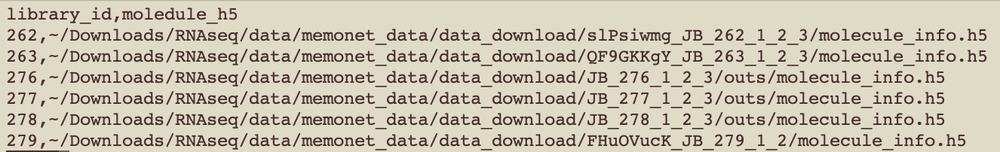

This file details all steps of the analysis for Chapter 1, including scripts and location of input/output data files.

# Set-up and download packages, data
## Set up working directory structure
```{r} 
mkdir RNAseq
cd RNAseq
mkdir data QC
cd data
mkdir our_data AIBSmapping
```

## Download Cell Ranger
- Follow steps here (make note of download location): https://support.10xgenomics.com/single-cell-gene-expression/software/pipelines/latest/installation

## Download the feature-barcode matrices:
- Download from: https://docs.google.com/spreadsheets/d/1mU7l8Oj-Fr4FYE6IlmTcX_s2YdCtZXx0GgJI3jBE3J4/edit#gid=0 
- Script for downloading: /data/zhanglab/jingwang/brain/RNAseq/Takaki/Deep/download.sh
- Download to: data/our_data/  
  - 262,263,279 had enough data at the second round and can be found here: /data/zhanglab/jingwang/brain/RNAseq/Takaki/Deep/deepseq_2
  - 276,277,278 were sequenced a third round and can be found here: /data/zhanglab/jingwang/brain/RNAseq/Takaki/Deep/deepseq_3


## Aggregate the data of all mice
Use the aggr command to combine the data of all mice
- Wd: /Data/our_data
- Generate a libraries.csv file with the locations of each mouse's data, in the following format: 

  - the order of rows determines the suffix attached to the barcodes of each mouse (in order to differentiate which mouse is which in the combined file), ie mouse 262 will have -1, 263 -2, etc
- Run aggr command:
  - First run this line on the terminal so that Cell Ranger package can be found, replacing the path with the location of your Cell Ranger download location: 
  ```{r} 
  export PATH=/home/kdunton/.local/share/cellranger-4.0.0:$PATH
  ```
  - Then run aggr. --none turns off depth normalization, due to the requirement of the DESC clustering package needing unnormalized counts as input. --id is the name of the output file
  ```{r}
  nohup srun -o jobs%j.out -c 20 \cellranger aggr --csv=/data/zhanglab/kdunton/6samples_cluster/deepseq_3_clustering/scrattch/libraries.csv --none --id=combined_cellranger_no-normalization &
  ```
   - The output directory will be found here: /data/zhanglab/kdunton/6samples_cluster/deepseq_3_clustering/scrattch/combined_cellranger_no-normalization/outs/filtered_feature_bc_matrix


# Cluster by cell type with DESC
1. Determine QC thresholds through metric visualization
- Script: /data/zhanglab/kdunton/neuron_model/katie-scripts/RNAseq/scripts_unorganized/test_QCthresholdsDESC.r 
- Usage: sbatch /data/zhanglab/kdunton/neuron_model/katie-scripts/RNAseq/scripts_unorganized/test_QCthresholdsDESC.sh
- Wd: /data/zhanglab/kdunton/6samples_cluster/deepseq_3_clustering/DESC/DESC_final_run/figures
- Input: location of each mouse folder, ie /data/zhanglab/jingwang/brain/RNAseq/Takaki/Deep/deepseq_2/slPsiwmg_JB_262_1_2_3/filtered_feature_bc_matrix/
- Output: 
  - ctrl_without_cutoff.png
  - QC_ctrl.png (or ctrl_with_cutoff30000.png)
  - train_without_cutoff.png
  - QC_train.png (or train_with_cutoff30000.png)

2. Cluster the cells
- Script: /data/zhanglab/kdunton/neuron_model/katie-scripts/RNAseq/DESC_step1.py
- Usage: sbatch /data/zhanglab/kdunton/neuron_model/katie-scripts/RNAseq/DESC_step1.sh
- Wd: /data/zhanglab/kdunton/6samples_cluster/deepseq_3_clustering/DESC/DESC_final_run
- Input:
  - Directory to 10X cellranger aggr folder: /data/zhanglab/kdunton/6samples_cluster/deepseq_3_clustering/scrattch/combined_cellranger_no-normalization/outs/filtered_feature_bc_matrix
  - Inside filtered_feature_bc_matrix you need to unzip the 3 files (matrix, barcodes, features) and rename features to cells.tsv
- Output: 
  - Slurm output file will give the number of cells per cluster (near bottom)
  - clusters.csv
  - umap.csv
  - tsne.csv
  - figures/umap0.8desc_0.8.png - umap with each cluster a different color
  - result_DESC/ - contains files on the encoders and models
  - desc_allgenes.h5ad - anndata object containing all genes passing QC
  - desc_result.h5ad- anndata object containing only HVG genes


3. 


